# Database schema design

PostgreSQL design for Slama Finance. Identity, company settings and Media are
implemented; other domains below remain the target design. Source schemas and
migrations in `api/db/` are authoritative for implemented functionality.

The current scope is one company, administrator-created email/password accounts,
dynamic roles, packaged product variants, manageable categories, clients, estimates, invoices, installment payments,
delivery notes, document customization, reports and email notifications.
Older OAuth and multi-organization proposals in `mvp-route-plan.md` are not used
here. Government e-invoicing integration, inventory, accounting journals and
payment gateways are outside this design.

Settings lifecycle update: bank accounts can be restored after archival. Bank accounts
and templates may be permanently deleted only when unreferenced; preserve audit and
asset history. All future `payments.bank_account_id`, `invoices.template_id` and
`estimates.template_id` references must use `ON DELETE RESTRICT` or `NO ACTION`,
never cascading deletion or `SET NULL`. Company default-template references also
block deletion. See [the action permission standard](implementation/permission-standard.md).

Click a section title to expand or collapse it. Schema levels start collapsed;
the reading guide starts expanded. L2 domains and integrity-rule groups can
also be expanded individually. This requires a Markdown viewer that supports
HTML `details` elements; Mermaid rendering depends on the viewer.

Media update: company/template images use nullable UUID references to `media_assets`,
not raw storage keys. Uploads are private and unused media expires after a 24-hour
grace period. Migration 0003 intentionally resets old image selections for re-upload,
without copying or deleting files. See [Media implementation](implementation/media-management.md).

<details open>
<summary>Reading the four levels</summary>

| Level | Purpose                | Contents                                                                   |
| ----- | ---------------------- | -------------------------------------------------------------------------- |
| L0    | Business relationships | Table names and cardinalities only; junction tables and fields hidden      |
| L1    | Relational structure   | Tables, primary keys, foreign keys and junction tables                     |
| L2    | Full business schema   | All business fields, types, keys and relationships                         |
| L3    | Auditing overlay       | Additional audit fields, actor relationships and append-only audit history |

Mermaid uses crow's-foot cardinalities: `||` means exactly 1, `o|` means 0..1,
`o{` means 0..N, and `|{` means 1..N. Labels describe relationships, not SQL
INNER/LEFT join operations. L0 shows logical many-to-many relationships directly;
L1 introduces the physical junction tables. Domain diagrams repeat shared table
names as references; they do not define duplicate tables.

</details>

<details>
<summary>Design decisions</summary>

- `company_settings` contains the single company identity and defaults. It is
  not a tenant table; no company selector or membership table is needed.
- Clients are customer records, not staff accounts. `clients.type` distinguishes
  `individual` from `company`, with type-specific identity fields and Moroccan
  business identifiers. This adds no relationship to authentication users.
- The company profile and client addresses target Morocco: default country
  `MA`, currency `MAD`, document locale `fr-MA` with `en-GB` supported, and
  company timezone `Africa/Casablanca`.
- Products are sold as fixed-weight packages, priced per item. Each product has
  one or more `product_variants`, each with immutable `weight_g` and its own
  `price_per_item`. A document line records an integer package quantity and
  snapshots the selected variant's weight and price. Loose-weight pricing and
  services are outside the current scope.
- `product_categories` supports listing, creating, renaming and archiving
  categories. A product may belong to one category or remain uncategorized;
  category hierarchy and multiple categories per product are not required.
- `invoices` and `invoice_lines` are separate from `estimates` and
  `estimate_lines`. Each has its own lifecycle and constraints. Templates and
  numbering infrastructure remain shared; there is no shared document parent.
- Optional non-unique `invoices.source_estimate_id` references `estimates.id`.
  One estimate may produce several invoices, retaining all previous invoices.
  Conversion creates an invoice and copies the estimate lines and snapshots.
- `payments` belongs directly to one invoice. An invoice can receive any number
  of installments. Splitting a single payment across several invoices is not
  required in this MVP, so no allocation junction table is introduced.
- `delivery_notes` is separate from financial documents and contains quantities
  without financial totals. Several delivery notes may reference one invoice.
  Delivery-first invoicing uses a separate allocation junction, preserving the
  original delivery note and allowing cancelled invoices to remain in history.
- Catalog and client records are references; issued documents retain snapshots
  so later catalog or address edits do not rewrite historical documents.
- Reports are computed from documents and received payments. Schedule and
  execution tables store delivery configuration and history, not another copy
  of the financial ledger.

</details>

<details>
<summary>L0 Business tables and relationships</summary>

No fields, FK declarations or junction tables appear in these diagrams.
Draft documents may have zero lines; issuing requires at least one line.

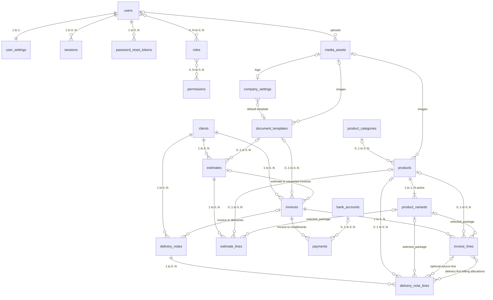

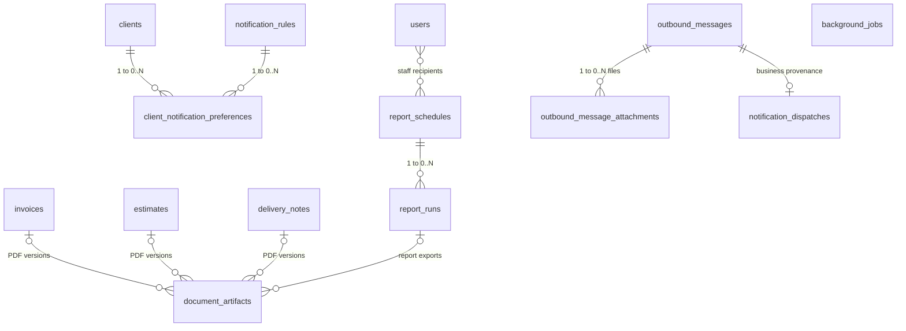

</details>

<details>
<summary>L1 Keys and junction tables</summary>

Only PK/FK columns are shown here. `PK, FK` denotes a key that is also a foreign
key. Two PK columns in a junction table form one composite primary key.
Optionality follows the relationship markers; L2 explicitly labels nullable
columns. The audit actors added at L3 are omitted at this level for readability.

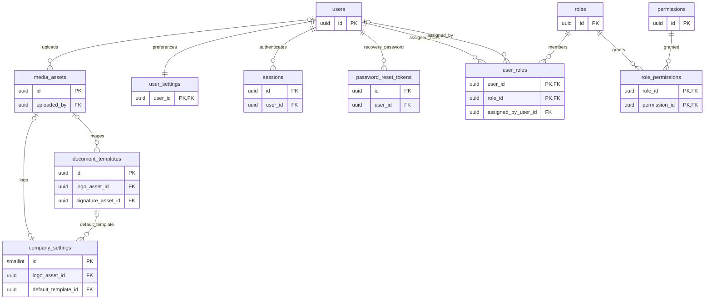

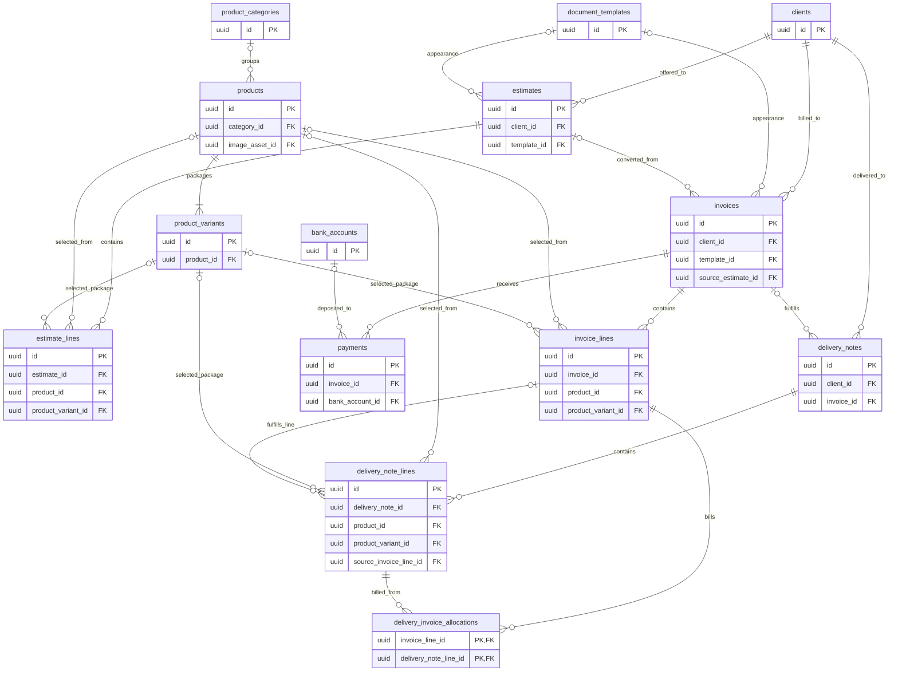

```mermaid
erDiagram
    clients { uuid id PK }
    users { uuid id PK }
    invoices { uuid id PK }
    estimates { uuid id PK }
    payments { uuid id PK }
    delivery_notes { uuid id PK }
    notification_rules { uuid id PK }
    client_notification_preferences { uuid client_id PK, FK
        uuid rule_id PK, FK }
    report_schedules { uuid id PK }
    report_schedule_recipients { uuid schedule_id PK, FK
        uuid user_id PK, FK }
    report_runs { uuid id PK
        uuid schedule_id FK }
    outbound_messages { uuid id PK }
    background_jobs { uuid id PK }
    notification_dispatches { uuid id PK
        uuid message_id FK }
    document_artifacts { uuid id PK }
    outbound_message_attachments { uuid id PK
        uuid message_id FK }
    clients ||--o{ client_notification_preferences : overrides
    notification_rules ||--o{ client_notification_preferences : overridden_rule
    report_schedules ||--o{ report_schedule_recipients : recipients
    users ||--o{ report_schedule_recipients : receives
    report_schedules ||--o{ report_runs : executes
    outbound_messages ||--o{ outbound_message_attachments : attaches
    outbound_messages ||--o| notification_dispatches : business_provenance
```

</details>

<details>
<summary>L2 Full business fields</summary>

Types are PostgreSQL types represented in Mermaid-friendly notation. `numeric`
amounts use `(18,2)`, unit prices `(18,6)`, weights `(18,3)` and percentages
`(5,2)`. All timestamps are `timestamptz`. `text` status fields have explicit
allowed-value CHECK constraints listed below. Fields are NOT NULL unless marked
`nullable`. UUID PKs default to generated UUIDs. Lifecycle timestamps and actors
are added in L3; L2 plus L3 is the complete proposed physical schema.

<details>
<summary>Identity and configuration</summary>

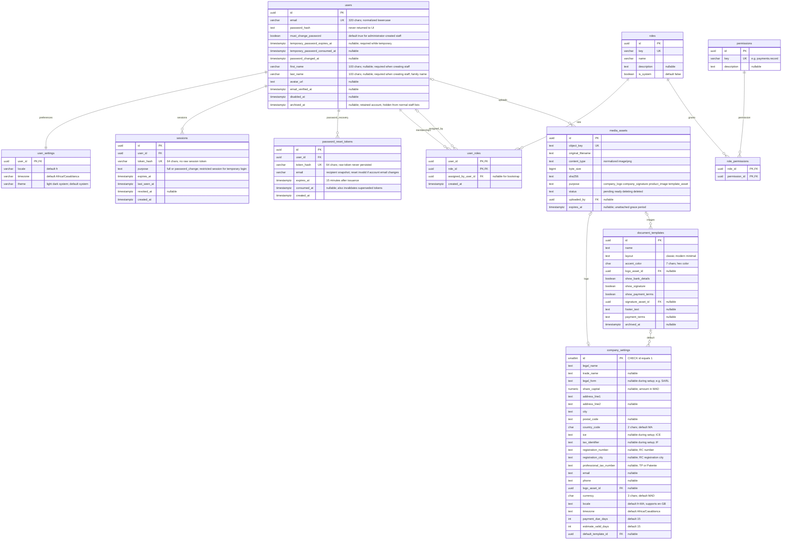

</details>

<details>
<summary>Clients and catalog</summary>

```mermaid
erDiagram
    product_categories o|--o{ products : groups
    products ||--|{ product_variants : packages
    clients {
        uuid id PK
        text type "individual or company; explicit selection required"
        text first_name "nullable; required for individual"
        text last_name "nullable; required for individual"
        text legal_name "nullable; required for company; raison sociale"
        text trade_name "nullable; company only"
        text contact_name "nullable; company contact person"
        text email "nullable"
        text phone "nullable"
        text ice "nullable; company only; ICE"
        text tax_identifier "nullable; company only; IF"
        text registration_number "nullable; company only; RC number"
        text registration_city "nullable; company only; RC registration city"
        text professional_tax_number "nullable; company only; TP or Patente"
        text address_line1
        text address_line2 "nullable"
        text city
        text postal_code "nullable"
        char country_code "2 chars; default MA"
        text delivery_address_line1 "nullable; NULL means use full billing address"
        text delivery_address_line2 "nullable"
        text delivery_city "nullable; required for separate delivery address"
        text delivery_postal_code "nullable"
        char delivery_country_code "nullable; required for separate delivery address"
        text locale "default fr-MA; supports en-GB"
        text notes "nullable"
        timestamptz archived_at "nullable"
    }
    product_categories {
        uuid id PK
        text name UK "case-insensitive normalized uniqueness"
        text description "nullable"
        timestamptz archived_at "nullable"
    }
    products {
        uuid id PK
        text reference UK
        text name
        text description "nullable; internal catalog content"
        uuid category_id FK "nullable; references product_categories.id"
        uuid image_asset_id FK "nullable; references media_assets.id"
        numeric suggested_vat_rate "nullable; default NULL"
        timestamptz archived_at "nullable"
    }
    product_variants {
        uuid id PK
        uuid product_id FK
        int weight_g "immutable package weight; positive"
        numeric price_per_item "price of one package; nonnegative"
        numeric cost_per_item "nullable; nonnegative"
        timestamptz archived_at "nullable"
    }
    bank_accounts {
        uuid id PK
        text name
        text bank_name
        text account_holder
        text rib "nullable; Moroccan bank account identifier"
        text iban "nullable"
        char currency "3 chars; default MAD"
        timestamptz archived_at "nullable"
    }
```

These are master records, with products optionally linked to categories. Their
document relationships appear below. A suggested product VAT rate never automatically
enables tax on a document line.

</details>

<details>
<summary>Estimates and invoices</summary>

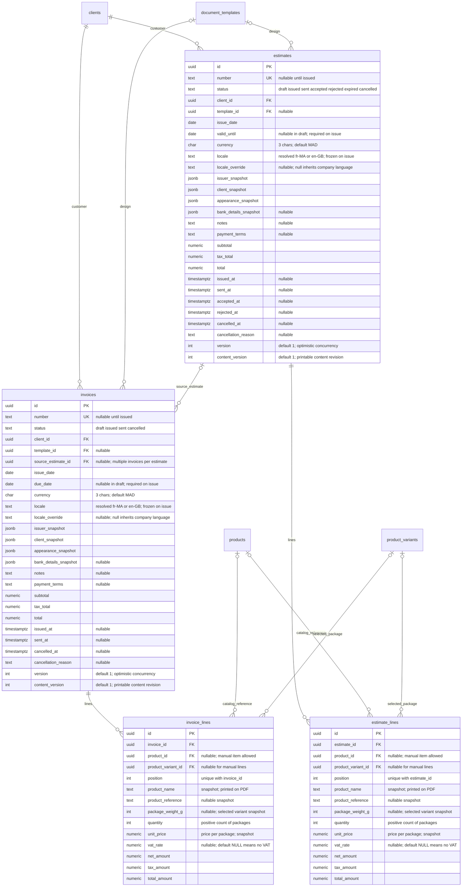

Public numbers use `FAC-YYYY-<random>`, `DEV-YYYY-<random>`,
`BL-YYYY-<random>` and `PAY-YYYY-<random>`. Use a cryptographically random
10-digit decimal suffix, preserved as text including leading zeros. Generate
inside the issuing/preparing/payment-recording transaction and enforce the
existing number UNIQUE constraints. On collision, retry with a new suffix
using a savepoint or conflict-safe operation; cap retries and fail atomically.
Numbers are immutable, never reused after cancellation, and independent of UUID
primary keys. The year is the assignment year in the company timezone, not a
backdated payment date. Drafts have no public number. No counter/sequence table
is needed. Random suffixes do not reveal a sequential document count and are
not authorization tokens. This is the agreed public-reference design, not a
claim of statutory numbering compliance: confirm invoice numbering requirements
with the company's accountant before production.

Snapshots have versioned application schemas: issuer/client snapshots contain
client type, the applicable personal or legal/trade names, structured addresses,
contact details, ICE, IF, RC number and city, and TP/Patente when supplied.
Issuer snapshots also include legal form and share capital when configured.
These snapshots use the identity and address structure specified below;
appearance snapshots contain the
selected layout, color, asset keys, visibility flags and footer/terms. They do
not contain credentials or arbitrary application state.

</details>

<details>
<summary>Payments and delivery notes</summary>

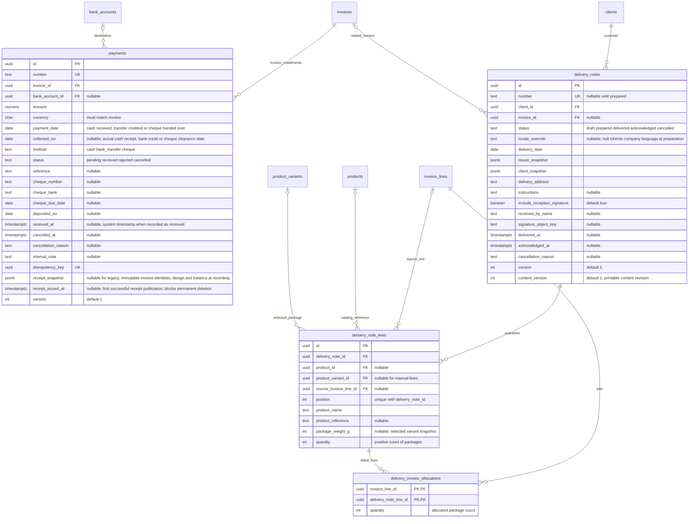

</details>

<details>
<summary>Notifications reports and stored documents</summary>

```mermaid
erDiagram
    clients ||--o{ client_notification_preferences : overrides
    notification_rules ||--o{ client_notification_preferences : rule
    users ||--o{ report_schedule_recipients : recipient
    report_schedules ||--o{ report_schedule_recipients : recipients
    report_schedules ||--o{ report_runs : executions
    notification_rules {
        uuid id PK
        text event_key UK "invoice_sent payment_received etc"
        boolean enabled "default false"
        int offset_days "default 0; negative means before event date"
        int repeat_every_days "nullable; positive"
        text sender_name
        text sender_email
        text locale "company fr-MA en-GB; default company"
        text subject_template
        text body_template
        text english_subject_template "nullable; required when sending English"
        text english_body_template "nullable; sanitized HTML"
        text body_format "text or html; legacy default text"
    }
    client_notification_preferences {
        uuid client_id PK, FK
        uuid rule_id PK, FK
        boolean enabled "explicit override; absent row inherits"
        text_array cc_emails "default empty"
    }
    report_schedules {
        uuid id PK
        text name
        text frequency "daily weekly monthly"
        smallint weekday "nullable; ISO 1 to 7"
        smallint month_day "nullable; 1 to 28 for MVP"
        time local_time
        text timezone
        text language "company fr en; default company; resolved in each run snapshot"
        text period "previous_day previous_week previous_month"
        text_array included_sections "nonempty; predefined report section keys"
        boolean enabled
        timestamptz next_run_at "nullable when disabled"
    }
    report_schedule_recipients {
        uuid schedule_id PK, FK
        uuid user_id PK, FK
    }
    report_runs {
        uuid id PK
        uuid schedule_id FK
        timestamptz scheduled_for "unique with schedule_id"
        date period_start
        date period_end
        jsonb configuration_snapshot
        jsonb data_snapshot "nullable until captured; versioned report sections and results"
        timestamptz data_captured_at "nullable until captured; actual database snapshot time"
        text status "queued running succeeded failed"
        int attempts "default 0"
        timestamptz next_attempt_at "nullable"
        uuid lease_token "nullable; identifies current worker claim"
        timestamptz locked_until "nullable; recover expired running jobs"
        timestamptz started_at "nullable"
        timestamptz finished_at "nullable"
        text error_code "nullable"
    }
    outbound_messages {
        uuid id PK
        text to_email
        text_array cc_emails "default empty"
        text from_email
        text from_name
        text subject
        text body_html
        text body_text "nullable"
        text status "queued sending sent failed cancelled"
        text idempotency_key UK "producer namespaced; occurrence and recipient"
        int attempts "default 0"
        int max_attempts "positive configured limit"
        timestamptz available_at "initial send time or next retry time"
        timestamptz locked_until "nullable; worker lease"
        uuid lease_token "nullable; identifies current worker claim"
        timestamptz sent_at "nullable"
        text provider_message_id "nullable"
        text last_error_code "nullable; no secrets"
    }
    document_artifacts {
        uuid id PK
        text document_type "invoice estimate delivery_note payment_receipt report_run"
        uuid document_id "owner ID; application-validated, not a database FK"
        int source_version "owner content_version; fixed 1 for report-run output"
        text format "pdf or csv"
        text object_key UK "private object storage"
        text mime_type
        bigint byte_size
        char sha256 "64 chars"
        timestamptz generated_at
    }
    outbound_message_attachments {
        uuid id PK
        uuid message_id FK
        text object_key "immutable private file; no business artifact FK"
        text filename "safe attachment display name"
        text content_type
        bigint byte_size "nonnegative"
        int position "nonnegative; unique per message"
    }
    background_jobs {
        uuid id PK
        text job_type "allowlisted business preparation task"
        int payload_version "positive schema version"
        jsonb payload "validated business inputs; no credentials"
        text idempotency_key UK
        text status "queued running succeeded failed cancelled"
        int attempts "default 0"
        int max_attempts "positive configured limit"
        timestamptz available_at
        uuid lease_token "nullable"
        timestamptz locked_until "nullable"
        timestamptz started_at "nullable"
        timestamptz finished_at "nullable"
        text last_error_code "nullable; no secrets"
    }
    notification_dispatches {
        uuid id PK
        text source_type "invoice estimate payment report_run delivery_note"
        uuid source_id "application-validated business owner; not FK"
        text event_key "allowlisted business notification event"
        text occurrence_key "stable occurrence and recipient identity"
        uuid message_id FK, UK
    }
    outbound_messages ||--o{ outbound_message_attachments : attaches
    outbound_messages ||--o| notification_dispatches : business_provenance
```

`text_array` means PostgreSQL `text[]`. Object keys identify private storage
objects; signed download URLs are generated on demand and are not persisted.
Draft previews do not become artifacts. Finalizing a document publishes one
immutable PDF for its printable content version; repeated downloads and emails
reuse that object. Enforce uniqueness on `(document_type, document_id,
source_version, format)` and never overwrite an issued PDF. Retained financial
PDFs are not deleted automatically to satisfy a free storage quota. Keep PDF
assets compact, track `byte_size`, and monitor total storage usage.
An artifact has exactly one owner: invoice, estimate, delivery note or report run.
The required `(document_type, document_id)` pair identifies that owner.
L0 shows logical ownership only; L1/L2 omit owner relationship edges because
this polymorphic reference has no ordinary database foreign key. The type is
restricted by a CHECK to `invoice`, `estimate`, `delivery_note`, or `report_run`.
Producers validate owner existence, access and source version before publishing
an artifact. Creation and owner deletion must lock the same owner row within
their transactions; deletion rejects owners with retained artifacts. Generic
database RESTRICT rules do not enforce this relationship. Download authorization
resolves the allowlisted type and checks access to its owner; never trust a
caller-supplied type/ID as proof of access or interpolate it into SQL.
Report producers enqueue one message per authorized staff recipient, allowing
individual delivery status. Email-provider secrets live in deployment
configuration, not notification rules.

### Generic delivery queue boundary

This is a PostgreSQL-backed transactional outbox/work queue, not a broadcast
pub/sub system: competing workers deliver each logical message. Initially the
producer modules and delivery worker share a database, but the worker receives
only ready-to-send payloads and never queries invoice, payment, report, user,
notification-rule or preference tables to make business decisions.

```text
Business module → policy/permissions → compose message and prepare files
                → commit ready message + attachments → delivery worker
                                                       → provider → outcome
```

- Business modules own notification rules, customer preferences, recipient
  eligibility, templates, schedules and document generation. They validate the
  business context before enqueueing. The queue validates only transport data:
  addresses, permitted sender, payload/attachment limits and safe file access.
- Insert ready messages and attachments atomically with the relevant business
  transaction. When PDF preparation is asynchronous, durably schedule that work
  in the business module first; its completion transaction enqueues the prepared
  message. Do not hold a database transaction open for rendering or uploads.
- Delivery payloads have no business FKs, polymorphic subject IDs or business
  metadata used for routing. Producers retain returned message IDs in their
  own `notification_dispatches` records for tracing/cancelling sends. A business timeline queries
  this producer-owned association, not invoice columns in the queue.
- Attachments reference immutable private object keys, not expiring signed URLs
  or artifact FKs. Producers may copy the key of a generated artifact. Storage
  cleanup must check both artifact and attachment references and must retain
  files needed for pending/retryable messages. Removing the FK means the database
  no longer enforces cross-module file retention; cleanup owns that guarantee.
- Future service extraction with a separate database requires a durable relay
  from the producer outbox and idempotent consumer enqueueing. A direct HTTP send
  does not replace the atomic business transaction/outbox guarantee.

Report output is published once per run and format; retries reuse an existing
artifact rather than overwriting it. The fixed report `source_version=1` is not
a mutable run version. A future explicit regeneration requires a separate run
identity; editing a completed run's output is not supported.

### Business preparation and dispatch tracking

- `background_jobs` durably tracks PDF/email preparation, using the same
  lease fencing, bounded retries and crash recovery rules as the other workers.
  Enqueue the job with the business mutation. Validate payloads by job type and
  version; persist stable source/content-version inputs rather than raw secrets.
  A retry with the same idempotency key must not change the requested work.
- Prepare immutable files outside the transaction. Completion checks the lease
  token and current business eligibility, then atomically inserts the ready
  outbound message, attachment references and dispatch record and marks the job
  succeeded. Retry with deterministic message keys to avoid duplicate enqueueing.
  Uploaded but unreferenced files are cleaned up only after a safe grace period.
- Scheduled report work stays in `report_runs`, not duplicated in
  `background_jobs`. Manual analysis exports remain on-demand file downloads:
  no report schedule, email or dispatch is created by exporting.
- `notification_dispatches` belongs to business modules, never to the delivery
  worker. Enforce UNIQUE `(source_type, source_id, event_key, occurrence_key)`;
  the occurrence key includes a stable recipient identity to support fan-out.
  The producer validates owner existence and event compatibility. The unique
  message FK permits at most one business dispatch per queued message; transport
  test messages can have none. Use this table for business timelines and targeted
  cancellation, and audit the actions separately.
- Business source references are application-enforced and indexed; dispatch
  rows contain no duplicated delivery status. Read status from the message.
  Keep minimal message metadata while referenced by dispatches; payload cleanup
  need not delete message identity. Explicit retention cleanup coordinates both.

### Printable content revisions

- `version` is the optimistic concurrency token. `content_version` on invoices,
  estimates and delivery notes changes only when printable content changes;
  draft line edits update both atomically. Artifact `source_version` references
  this content revision, not the mutable concurrency token.
- Issuing/preparing freezes the printable content and final snapshots, including
  the assigned number. Increment content_version for that finalization. Later
  sending, payment or lifecycle status updates do not alter the issued PDF or
  its content revision. Display live balances/status separately, outside the
  original document; corrections follow cancellation and replacement rules.
- Delivery acknowledgment metadata may change without rewriting the prepared
  PDF. A separate signed acknowledgment artifact needs its own document variant.
  Payment receipts use the `payment_receipt` variant, never replacing an invoice.
  Their artifact source version follows payment `version`: confirmation,
  cancellation and restoration invalidate the previous PDF. Their financial
  snapshot remains immutable. One active receipt artifact is replaced atomically;
  superseded objects use unreferenced cleanup. Scheduled report output remains v1.

</details>

</details>

<details>
<summary>L3 Auditing and traceability</summary>

L3 extends L2. It does not repeat every business field. The fields below are
the full audit additions; business lifecycle fields such as `received_at` and
`issued_at` remain those defined in L2.

### Audit columns applied to business records

`background_jobs` receives `created_at`, `updated_at`, `created_by_user_id` and
`updated_by_user_id` with the shared timestamp/actor types. Business-owned
`notification_dispatches` receives `created_at` and `created_by_user_id`;
dispatch identity is immutable and explicit removal is audited.

`delivery_invoice_allocations` receives the shared created/updated timestamps
and user actors. `outbound_message_attachments` receives `created_at` and
`created_by_user_id`. Their creation/removal is audited; neither may silently
change after its invoice is issued or its message first becomes sendable.

| Tables                                                                                                                                                                                                                                                                                                         | Additional columns                                                                                                                                           |
| -------------------------------------------------------------------------------------------------------------------------------------------------------------------------------------------------------------------------------------------------------------------------------------------------------------- | ------------------------------------------------------------------------------------------------------------------------------------------------------------ |
| users, user_settings, roles, permissions, company_settings, document_templates, clients, product_categories, products, bank_accounts, invoices, invoice_lines, estimates, estimate_lines, payments, delivery_notes, delivery_note_lines, notification_rules, client_notification_preferences, report_schedules | `created_at timestamptz NOT NULL`, `updated_at timestamptz NOT NULL`, `created_by_user_id uuid NULL FK users.id`, `updated_by_user_id uuid NULL FK users.id` |
| role_permissions, report_schedule_recipients                                                                                                                                                                                                                                                                   | `created_at timestamptz NOT NULL`, `created_by_user_id uuid NULL FK users.id`                                                                                |
| report_runs, outbound_messages, document_artifacts                                                                                                                                                                                                                                                             | `created_at timestamptz NOT NULL`, `created_by_user_id uuid NULL FK users.id`                                                                                |
| sessions, user_roles                                                                                                                                                                                                                                                                                           | Already have `created_at` in L2; `user_roles.assigned_by_user_id` is its creation actor                                                                      |

Defaults for new timestamps are `now()`; `updated_at` must also be refreshed on
mutation. Existing auth timestamps are reused, not duplicated. Actor FK values
are nullable for bootstrap, scheduled jobs and service-originated changes.
Both actor columns reference `users.id`, including on the users table itself.
Archive/status columns represent business state; there is no blanket soft-delete
column on financial records.

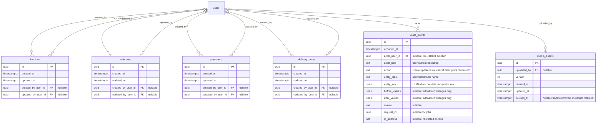

The four illustrated business tables demonstrate the shared audit pattern;
the preceding table is the authoritative full coverage list. `audit_events`
is append-only and does not itself receive the shared audit columns.
`entity_table` plus `entity_key` is a logical reference, not a polymorphic FK.
It supports both UUID records and composite keys such as role membership, and
retains history after an allowed draft/junction deletion.

Write each business mutation and its audit event in the same transaction. The
application database role may insert/read audit events but may not update or
delete them. No cascading deletion targets the audit log. Role grants and
revocations, financial transitions and settings changes must all be recorded.
Password hashes, session tokens/hashes, email bodies and secrets must never
appear in audit snapshots. Prefer changed fields over entire record dumps;
limit personal-data retention and audit access separately from normal reporting.
This is operational traceability, not a claim of cryptographic tamper-proofing.

</details>

<details>
<summary>Integrity and calculation rules</summary>

<details>
<summary>Client identity and Moroccan company profile</summary>

- CHECK `type IN ('individual', 'company')`. For individuals, require nonblank
  `first_name` and `last_name`; company identity, contact-person and business
  identifier fields must be NULL. For companies, require nonblank `legal_name`
  and keep personal first/last names NULL. A contact person is optional and is
  not the legal billing identity. These are database CHECK constraints, not
  just conditional UI fields.
- Derive the UI display name from the individual's full name or the company's
  legal name; do not store another independently editable `name`. Search can
  include the trade name and company contact, but PDFs use the legal identity.
- Unattached clients may be deleted with `clients.delete` and an expected
  version. Invoice, estimate, and delivery-note client foreign keys must use
  `ON DELETE RESTRICT`; attached clients remain archivable but not deletable.
- Company identifiers may be collected progressively. Individuals do not need
  business identifiers, and CIN is not collected in this scope. Sole traders or
  other customer types requiring personal and business identities together need
  an explicit extension of this two-type model.
- Use the same field names for company identifiers in clients and
  `company_settings`: `ice` (ICE), `tax_identifier` (IF),
  `registration_number` and `registration_city` (RC), and
  `professional_tax_number` (Taxe professionnelle / Patente).
  Store identifiers as text to preserve leading zeros; trim blank values to
  NULL. Validate supplied identifiers with approved format rules and show
  localized field names. Do not assume all identifiers have the same length
  or impose global uniqueness on RC numbers without their registration city.
- Treat RC number and registration city as a pair: either both are supplied
  or both are NULL. This applies to customer companies and company settings.
  `share_capital` is nullable and nonnegative, using the monetary precision
  defined at L2. A missing value is not equivalent to zero capital.
- `address_line1`, `city`, `postal_code` and `country_code` describe the billing
  address. Country defaults to `MA`; postal codes are text. For a separate
  delivery address, require a nonblank first line, city and country. If the
  delivery first line is NULL, all other delivery address fields must be NULL
  and the complete billing address is used. Never merge parts of two addresses.
- Phone and email remain optional for record creation. Normalize supplied
  phone numbers to international format using Morocco as the default country,
  while accepting valid foreign numbers. Email notifications require a valid
  email address; an absent address must not prevent cash sales.
- Company settings use `MAD`, `fr-MA` and `Africa/Casablanca` by default.
  System language is centrally configured by company locale (`fr-MA` or `en-GB`).
  Draft invoices/estimates/delivery notes have nullable `locale_override`; issuing freezes
  the resolved company default or explicit override. Client locale is contact metadata,
  not an implicit document override. Staff UI preferences remain independent.
- Company bank details stay in `bank_accounts`, already designed to support
  multiple accounts. Snapshot the selected payment details on issued documents;
  do not duplicate editable RIB/IBAN columns in `company_settings`.
- Before issuing, validate issuer and recipient information against the approved
  document requirements for the relevant client type. Optional onboarding
  fields may become required at this step. The exact legally required fields
  and format checks must be confirmed before implementation; this schema is
  a data model, not a declaration that every listed identifier is mandatory.
- Changing a client's type requires replacing incompatible identity fields in
  one transaction and recording the change in the audit log. Already-issued
  invoices, estimates and delivery notes retain their original snapshots.

</details>

<details>
<summary>Packaged products and categories</summary>

- Variant `weight_g` is a positive integer and immutable after creation;
  prices per package are nonnegative. A product must always have at least one
  active variant. The product/weight pair is unique, including archived rows.
- Choosing a variant copies its product name, reference, package weight and
  per-item price into the line. Quantity is a positive integer package count.
  Display weight in g or kg without changing the stored price basis.
- Historical line snapshots do not change when a variant price, archive state
  or product category changes.
- Enforce category-name uniqueness with a unique index on `lower(trim(name))`
  and reject blank names. Archived names remain reserved; restore a category
  instead of creating a duplicate. A category must be active for new product
  assignments. Existing links survive archival until explicitly reassigned.
- `products.category_id` references `product_categories.id` with RESTRICT on
  deletion. Archive referenced categories; delete only unused categories.
- Add application permission keys `categories.view`, `categories.create`,
  `categories.update` and `categories.archive` to the existing permission
  registry. Category changes use the same L3 audit pattern as product changes.

</details>

<details>
<summary>Staff authentication and RBAC safeguards</summary>

- Administrators create staff accounts with a cryptographically generated
  temporary password. Store only its password hash, require an expiry and set
  `must_change_password=true`. Never include the plaintext in audit records,
  logs or persisted email bodies; expose it once through the authorized setup
  flow. Public registration is not supported.
- A successful temporary login atomically consumes the credential and creates
  a short-lived `sessions.purpose=password_change` session. Lock/recheck the
  user row so concurrent logins cannot both consume it. Reject expired or
  already-consumed temporary passwords. This session permits only password
  replacement and logout, never dashboard/business API access.
- Password replacement requires a new password different from the temporary
  one. Atomically update its hash, clear the temporary expiry/consumption fields,
  set `password_changed_at`, clear `must_change_password`, revoke existing
  sessions and issue a fresh full session. Never upgrade a client-provided
  session purpose. Enforce these restrictions server-side as well as in the UI.
- If setup is interrupted after consumption and the restricted session is lost
  or expired, an administrator generates a new temporary password. Reissuing
  invalidates the previous credential and all sessions. The same flow supports
  administrator-assisted recovery. Self-service email reset is now also approved:
  generic public response, hashed single-use token, 15-minute expiry, rate limits,
  and atomic password replacement/token consumption/session revocation. Disabled
  or archived accounts are ineligible. Production delivery uses the configured
  Resend API; tests use an in-memory adapter. Reset UI remains to be connected.
- Protect the bootstrap administrator role/key and its essential user/role
  management grants. At least one active, fully onboarded administrator must
  remain. Serialize administrator membership, role and disable mutations using
  a shared transaction lock before checking this invariant. `is_system` roles
  cannot be deleted; non-system role permissions remain configurable.
- Disabling a user or resetting their password revokes sessions. Resolve current
  permissions on every protected request (or use synchronously invalidated
  authorization caches); stale session claims must not retain revoked grants.
- Staff deletion archives the account (`archived_at`) without removing records,
  role assignments or financial/audit references. Default lists exclude archived
  accounts; explicit archived/all filters support historical lookup. Archive also
  disables access and invalidates sessions and recovery tokens. Enable does not
  restore archived accounts. Permissions are inherited from roles only.

</details>

<details>
<summary>Financial documents and optional VAT</summary>

- `quantity > 0`, prices and totals are nonnegative. Compute using decimal
  arithmetic and round each monetary line to two decimals before summing.
  `net_amount = round(quantity * unit_price, 2)`;
  `tax_amount = 0` when VAT is NULL, otherwise
  `round(net_amount * vat_rate / 100, 2)`;
  `total_amount = net_amount + tax_amount`.
- NULL VAT means not applied; explicit `0` means a selected zero rate. Rates
  must be between 0 and 100. Catalog selection does not copy VAT automatically.
- Document totals equal the sums of their lines. Persist recalculated totals
  and lines in one transaction; never trust totals supplied by the browser.
- Drafts may be incomplete. Issuing requires at least one line, company/client
  snapshots and the appropriate due date or validity date. Issued document
  content and snapshots are immutable; status/payment changes remain allowed.
- Each table has its own status CHECK constraint. Invoices have due dates;
  estimates have validity dates and acceptance/rejection timestamps. Validate
  allowed state transitions separately for each table.
- `invoices.source_estimate_id` is a nullable, indexed, non-unique FK to `estimates.id`.
  Conversion requires an accepted estimate with the same client and currency,
  and copies `estimate_lines` into `invoice_lines` in a transaction. The source
  estimate remains preserved. One estimate may produce multiple invoices;
  invoices may also be created directly without a source estimate. Existing
  invoices, including cancelled ones, are never removed by a new conversion.
  Each intentional conversion is a new operation; retries of that operation
  must reuse its invoice UUID rather than create duplicates. The UI shows
  previous conversions and requires explicit confirmation for another invoice.
  This relationship is provenance, not a cap on cumulative invoiced amounts.
- `payments.invoice_id` and `delivery_notes.invoice_id` reference `invoices.id`;
  `delivery_note_lines.source_invoice_line_id` references `invoice_lines.id`.
  These foreign keys cannot point to estimates or estimate lines.

</details>

<details>
<summary>Installments and pending cheques</summary>

- Payment amount must be positive. `paid_amount` is derived from payments with
  `status=received`; pending, rejected and cancelled payments contribute zero.
- `balance_due = invoice.total - paid_amount`. The UI derives unpaid,
  partially paid and paid badges separately from the document lifecycle.
  Overdue means an issued/sent invoice past its due date with a positive balance.
- A cheque starts pending; clearing changes it to received and sets
  `collected_on` to its actual clearance date and `received_at` to the system
  transition timestamp. A pending cheque must not appear as collected revenue.
- `payment_date` records the actual cash receipt, bank credit or cheque handover
  date. For cash and transfers recorded as received, `collected_on` equals
  `payment_date`. For cheques it is the clearance date, not the handover,
  deposit or cheque due date. Require `collected_on >= payment_date` and, when
  present, `collected_on >= deposited_on` for a cleared cheque.
- Require `collected_on` and `received_at` for received payments. Pending and
  rejected payments have neither. Cancellation preserves existing collection
  dates/timestamps for traceability but excludes the payment from live collected
  totals. `created_at` records entry into the system; neither it nor
  `received_at` is the effective collection date used by financial reports.
- Allow authorized staff to enter past payment/collection dates. Audit the
  effective dates, actor and actual recording time; never backdate system audit
  timestamps. Actual receipt/collection dates cannot be in the future in the
  company timezone; a cheque due date may be. Correct a received entry through
  the existing cancellation/replacement workflow, not silent date edits.
- Collections, payment-method breakdowns and related summary metrics filter
  received payments by `collected_on`. A January 31 cash receipt entered on
  February 2 appears in live January analysis, while a January report captured
  before that entry remains unchanged. Cheques handed over in January and
  cleared in February contribute to February collections only.
- Require a cheque number and issuing bank for cheques; require a transfer
  reference for bank transfers. Non-cheque records cannot hold cheque fields.
- Payments must reference issued/sent invoices and match invoice currency;
  selected bank-account currency must match too. Lock the invoice row when
  recording or clearing a payment, recalculate its balance and reject overpayment.
  Concurrent installments must not each spend the same remaining balance.
- Pending cheque amounts are checked against current balance at recording,
  and checked again at clearing. They do not reserve paid balance. If another
  payment settles the invoice first, clearing needs manual resolution.
- Authorized staff may cancel, restore, or delete payment records. Cancellation
  collects its reason in a confirmation modal, not an inline page field.
  Restoration returns a cancelled payment to its prior pending/confirmed state,
  provided the invoice is payable and its available balance is sufficient.
  Deletion is available for every payment status, requires confirmation, and
  removes the payment from live balances. All actions require a version check
  and preserve an audit event; they do not initiate a bank refund. Deleted
  creation-operation keys remain recorded in the audit trail so a delayed
  retry cannot recreate a deleted payment. See implementation sequence 10 for
  the implemented payment statuses and reservation rules.
- Cancelling an invoice with received payments requires resolving those
  payments first. Credit notes and actual refunds need a separate design.

</details>

<details>
<summary>Delivery notes</summary>

- A related invoice must belong to the same client. A source line must
  belong to that invoice. Product snapshots must match the linked line; weight
  units may differ only with explicit g/kg conversion.
- Require positive weights and at least one line before preparing a note.
  Across non-cancelled notes linked to the same invoice line, allocated delivery
  weights, normalized to kilograms, cannot exceed the invoiced weight.
  Lock source lines when saving
  allocations to make this safe under concurrent deliveries.
- Acknowledgment requires delivery first and captures receiver name and time.
  Preserve prepared/delivered snapshots; correct through cancellation and a new
  note. No inventory stock movements or pricing fields are added here.

- Delivery-first workflow: a delivered/acknowledged note without a source
  invoice may be invoiced later. Keep its existing `invoice_id` and
  `source_invoice_line_id` NULL; these fields describe invoice-first fulfillment
  only. Use `delivery_invoice_allocations` for the opposite workflow instead
  of rewriting the delivery document. Never represent the same fulfillment in
  both mechanisms. For invoice-first notes, require source invoice lines.
- An invoice may combine eligible notes for the same client. Copy product name,
  reference and delivered weight into invoice lines; staff confirms prices and
  explicitly selects VAT, which remains absent by default. Delivery notes have
  no authoritative prices. Allocation weights use exact kilograms `(21,6)` so
  conversion from `(18,3)` grams does not lose precision.
- Lock delivery source lines in stable ID order when allocating, issuing,
  deleting a draft allocation or cancelling an invoice. Draft allocations
  reserve weight; issued allocations consume it. Total reserved/billed weight
  across non-cancelled invoices must not exceed delivered weight. Allocations
  must match the client, product snapshot and normalized invoice-line weight;
  a delivery-derived invoice line is fully covered by its allocations.
- Cancelled invoices retain their allocation rows for history but release the
  billable weight, allowing a replacement invoice. A delivery note with active
  billing allocations cannot be cancelled until those allocations are resolved.
  The existing invoice-first rule also reserves quantities in draft notes;
  expose these reservations in the UI and release them on draft deletion or
  cancellation. Creating a draft is not proof of actual delivery or billing.

</details>

<details>
<summary>Scheduling notifications and artifacts</summary>

`report_schedules.included_sections` selects the predefined sections to include
in each report. Administrators select these options using checkboxes; this is
not an arbitrary report formula or query builder.

### Dashboard, analysis and saved reports

- The dashboard is a live overview. Reports → Analysis provides live detailed
  filters, grouping and exports from the same underlying records. Identical
  periods, filters and metric definitions must yield identical figures.
- Reports → Scheduled reports manages schedules, recipients and generated
  report history. Each generated report freezes its configuration, results and
  PDF/CSV artifacts. Subsequent payments or corrections never update that report.
- Capture all report sections from one consistent database read snapshot and
  atomically persist `data_snapshot` with `data_captured_at`, fenced by the
  worker lease token. Both fields are NULL before capture and set together once.
  Retries after capture render from those saved results, never re-query live
  financial data. Successful runs require a captured snapshot and artifacts.
- Show “Live data” on dashboard/analysis and “Generated on” plus the selected
  period and actual capture time on saved reports. An export freezes its contents
  when generated; opening a saved report never recalculates it. A regenerated
  export is a new output, not an overwrite of the previous file.
- MVP does not reconstruct arbitrary past database states from audit history.
  Period activity uses the selected dates and currently recorded corrections;
  balances and statuses reflect the actual capture time. A delayed January run
  is labeled with its actual capture time, not claimed to be a January 31 state.
  Live historical analysis can therefore differ from an archived report.

| Section key         | Included information                                        | Time basis                                           |
| ------------------- | ----------------------------------------------------------- | ---------------------------------------------------- |
| `summary`           | Invoiced sales, collected payments and outstanding balance  | Period activity plus balance at capture              |
| `revenue`           | Issued, non-cancelled invoice amounts                       | Selected period                                      |
| `collections`       | Received payments, including installments                   | Selected period                                      |
| `outstanding`       | Remaining balances on unpaid and partially paid invoices    | At capture                                           |
| `overdue`           | Past-due invoices, days overdue and remaining amounts       | At capture                                           |
| `payment_methods`   | Received payments grouped by cash, bank transfer and cheque | Selected period                                      |
| `pending_cheques`   | Cheques awaiting deposit or clearance                       | At capture                                           |
| `vat`               | VAT charged on invoices where explicitly applied            | Selected period                                      |
| `sales_by_client`   | Invoiced sales grouped by client                            | Selected period                                      |
| `sales_by_product`  | Invoiced sales amounts and weights sold per product         | Selected period                                      |
| `sales_by_category` | Invoiced sales amounts and weights sold per category        | Selected period                                      |
| `estimates`         | Estimates issued, accepted, rejected, expired and converted | Lifecycle activity in selected period                |
| `deliveries`        | Delivery notes and delivered weights by status              | Delivery dates in selected period; status at capture |

Example schedule selection:

```json
{
  "name": "Weekly finance summary",
  "included_sections": ["summary", "collections", "overdue", "pending_cheques"]
}
```

- Require at least one section, reject duplicate/unknown keys, and preserve
  selected order for report rendering. Store the selection in each run's
  `configuration_snapshot` so later schedule changes do not alter run history.
- Revenue represents invoiced sales, not cash receipts or a full accounting
  revenue-recognition calculation. Show net, VAT and gross amounts separately.
  Collections use received payments only; pending cheques are excluded.
- Period activity and balances at capture are different measures. Use the schedule
  timezone to establish boundaries, with an inclusive start and exclusive end.
  Collections use the actual `collected_on` date, not entry/transition timestamps;
  for invoiced sales use `issue_date` and include only issued, non-cancelled
  invoices as recorded at capture. State these bases in the report. Audit logs
  remain for traceability, not reconstruction of earlier financial states.
- Estimate event counts may overlap: an estimate can be issued and accepted
  in the same period. Conversion uses invoice creation/issue history and
  `source_estimate_id`. For delivery reports, pending notes show planned weight
  separately; only delivered/acknowledged notes contribute delivered weight.
- Normalize product/category weights to kilograms when aggregating grams and
  kilograms. Group amounts by currency; never add different currencies together.
  Category grouping uses the product's current category in this MVP, with an
  explicit uncategorized group; historical category snapshots require a future
  schema extension. Manual lines without a catalog product remain a separate
  group. The report must disclose this classification basis.

- Weekly schedules require `weekday`; monthly schedules require `month_day`;
  irrelevant day fields are NULL. Use an IANA timezone and calculate next runs
  in UTC. Monthly days 1–28 avoid ambiguous short-month behavior for this MVP.
- UNIQUE `(schedule_id, scheduled_for)` prevents duplicate scheduled runs.
  Recipient membership uses composite PK `(schedule_id, user_id)`.
- The report producer checks active-user and report permissions when generating
  and enqueueing reports. An enabled schedule needs an eligible recipient.
- Split permissions into `reports.view`, `reports.export`,
  `reports.schedules.manage`, and `reports.sections.<section_key>` for each of
  the 13 section keys above. Schedule managers may select only sections they
  can view and recipients authorized for the full selection. Export requires
  view, export and all selected section permissions. `summary` is an explicit
  aggregate-data grant, not a bypass around financial-data authorization.
  Recheck each recipient before enqueueing and on authenticated artifact download;
  if any required permission is missing, do not enqueue that recipient. Apply
  the same gates to UI controls and API access. The delivery worker does not
  query RBAC. Prefer authenticated links for sensitive reports when access must
  remain revocable after enqueueing; emailed attachments cannot be revoked.
- Client preferences override the matching default rule; absence inherits.
  A missing/invalid email disables actual delivery regardless of preference.
- Outbound messages are a transactional outbox: create them with the triggering
  business transaction; workers claim with a lease, retry and store delivery
  results. Unique producer-namespaced idempotency keys identify event, recipient
  and occurrence. Re-enqueueing the same key returns the existing message ID;
  reject a different payload for that key rather than overwrite the message.
  Provider timeouts can still produce duplicate email unless the provider also
  supports idempotency; do not promise exactly-once delivery.
- Business preparation, report and email workers atomically claim eligible jobs using row locks
  with `SKIP LOCKED`, increment attempts and assign a fresh lease token/expiry.
  Commit the claim before external I/O. Heartbeats and completion updates must
  match the current token; stale workers cannot update a reclaimed job. Reclaim
  expired running/sending jobs after a crash. Use bounded exponential backoff
  with jitter, a configured attempt limit and terminal failed state; an audited
  administrator retry reuses the same logical job and deduplication identity.
  Bound worker concurrency and provider send rate independently. No database
  transaction remains open while generating PDFs or contacting the provider.
  Lease fencing protects database state, not an already-started external send;
  use provider idempotency where available and surface uncertain deliveries.
- Attach exact immutable files using `outbound_message_attachments` before
  a message becomes eligible for sending. Enforce unique message/position and
  have the producer validate file ownership before enqueueing. Retried sends reuse the
  same recipients, payload and artifacts; changed content requires a new message.
  Generation publishes artifacts idempotently using owner/version/format keys;
  failed or stale workers must not overwrite an already-published object.
- Business cancellation, preference changes and permission revocations must
  explicitly cancel relevant queued messages using producer-retained IDs.
  Atomically transition queued → cancelled, competing with worker claims;
  cancellation of an already-sending/sent message is not guaranteed. Never
  relabel a delivered email as unsent. Audit cancellation/retry requests.
- Ready payloads and attachment rows are immutable. The worker modifies only
  delivery state. Enforce attempts >= 0, max_attempts > 0, and a valid lease
  token/expiry for sending jobs. `available_at` controls initial delay and retry
  eligibility; expired sending leases are independently reclaimable. Exhausted
  attempts become failed, including jobs whose final claim crashed. An explicit
  authorized retry raises the attempt budget without erasing attempt history.
- Message bodies and recipient addresses contain personal data. Restrict queue
  access and define retention/redaction independently of business-document
  retention. Keep a deduplication tombstone for the retry horizon if payloads
  are purged; deleting the unique key can otherwise allow a duplicate enqueue.
- Artifact owner fields are NOT NULL. Enforce one UNIQUE constraint on
  `(document_type, document_id, source_version, format)`, with positive source
  versions. Its leading columns also support owner lookups. Business cancellation
  does not delete issued PDFs. Owner integrity is application-enforced rather
  than protected by per-document foreign keys.

</details>

</details>

<details>
<summary>Constraints indexes and deletion policy</summary>

Cross-record rules (matching client/currency, aggregate payment
and delivery limits) cannot be expressed as simple PostgreSQL CHECK constraints.
Enforce them through transactional services with row locks and, where useful,
database triggers. Separate invoice and estimate FKs enforce the target record
type directly; services still enforce lifecycle and cross-record consistency.

Recommended indexes in addition to PKs and UNIQUE constraints:

- Index each FK unless it is already the leading column of a PK/index.
  Junction tables also need reverse lookup indexes such as `user_roles(role_id)`.
- `invoices(client_id, issue_date)` and `invoices(status, due_date)`.
- `estimates(client_id, issue_date)` and `estimates(status, valid_until)`.
- `payments(invoice_id, status)` and `(payment_date, method)`.
- `payments(collected_on, method) WHERE status = 'received'` for collection reports.
- `delivery_notes(client_id, delivery_date)` and line source-reference indexes.
- `outbound_messages(status, available_at)` for worker polling.
- `background_jobs(status, available_at)` plus expired-lease recovery indexes.
- The dispatch UNIQUE index starts with `(source_type, source_id)` for business
  timelines; unique `message_id` supports reverse lookup and its FK.
- `report_runs(status, next_attempt_at)` and lease-expiry indexes for recovering
  abandoned report/email work. Claim queries also check scheduled time.
- Partial `report_schedules(next_run_at) WHERE enabled`.
- `audit_events(entity_table, entity_key, occurred_at)` and
  `(actor_user_id, occurred_at)`; add JSON indexes only when query patterns need them.
- UNIQUE `(invoice_id, position)` on invoice lines, `(estimate_id, position)`
  on estimate lines and `(delivery_note_id, position)` on delivery-note lines.

Archive clients, products, referenced categories, templates and bank accounts rather than deleting
referenced records. Disable users to preserve financial/audit attribution.
Archived templates remain available to historical documents but cannot be
selected for new ones. Archiving the company default must atomically clear or
replace `company_settings.default_template_id`; issued appearance snapshots
and stored PDFs remain unchanged. Attachment `message_id` uses RESTRICT for
normal deletion; explicit queue retention cleanup removes child rows first and
coordinates object retention across both file-reference tables.
Do not automatically delete issued documents or saved reports until an approved
retention policy exists. Email bodies have a separately configurable, shorter
operational retention period; preserve minimal delivery/dispatch metadata and
idempotency identity as required. Define backup retention and complete a tested
restore before launch. Exact durations and audit access rules need owner approval.
Use RESTRICT for financial/master-data FKs and audit actors. Draft deletion may
explicitly remove its lines; it must be prohibited after issue. Membership and
recipient rows may be deleted with an audit event. Cascading user preferences
and sessions may retain the existing auth behavior, but normal staff operations
must disable accounts instead of physically removing them.

</details>

<details>
<summary>Decisions to confirm before implementation</summary>

1. Confirmed public references: FAC/DEV/BL/PAY, assignment year and random
   10-digit suffix; no public sequential counter. Accountant validation remains
   a production prerequisite for invoice numbering requirements.
2. Confirmed: one estimate may produce multiple invoices without deleting
   earlier ones. Credit notes, refunds and multi-invoice payment allocations
   are not included; this does not introduce a deposit-invoice workflow.
3. Payment tracking covers received installments, not contractual future
   installment schedules with separate due dates.
4. The exact VAT rate choices, rounding examples, document wording and legal
   identifiers must be approved before finalizing document templates.
5. Confirmed retention approach: configurable policies, no automatic financial
   document deletion before approval, shorter email-body retention, and backup
   restoration testing before launch. Exact durations and sensitive audit access
   remain to be approved. VAT stays opt-in; approve rate choices, worked rounding
   examples and final printed templates with the client/accountant.
6. Confirmed: delivery notes support invoice-first partial delivery and
   delivery-first invoicing through line allocations. They do not decrement
   inventory or introduce warehouse management.
7. Confirmed — review item 3: dashboard and analysis remain live; generated
   reports preserve immutable configuration, result snapshots and artifacts.
   Arbitrary historical-state reconstruction is outside the MVP.
8. Confirmed — review item 9: collections use `collected_on`, the effective cash
   receipt, bank credit or cheque clearance date. Backdated entries are allowed
   and audited; recording timestamps remain system-generated. Live historical
   analysis reflects late entries, but previously generated reports stay frozen.

</details>
